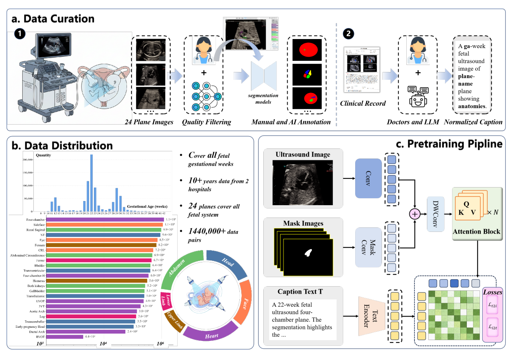

<div align="center">

# SonoCLIP

### Mask-Guided Region-Aware Vision-Language Pretraining for Fetal Ultrasound Analysis

[]()
[](https://github.com/Harrison-one/SonoCLIP)
[](LICENSE)
[]()
[]()

Official PyTorch implementation of **SonoCLIP**, a region-controllable vision-language foundation model for fetal ultrasound analysis.

[Introduction](#-introduction) | [Highlights](#-highlights) | [Method](#-method) | [Quick Start](#-quick-start) | [Evaluation](#-evaluation) | [Results](#-main-results) | [Acknowledgments](#-acknowledgments) | [Citation](#-citation) | [License](#-license)

</div>

## 🔥 News

- **2026-06-20**: Codebase and overview figure are released.

## 📌 Introduction

Fetal ultrasound is widely used in prenatal screening, but automatic analysis remains difficult because of speckle noise, acquisition variability, view-dependent artifacts, and subtle anatomical boundaries. Generic CLIP-style vision-language models usually rely on global image-text alignment, which can miss clinically important local structures.

SonoCLIP addresses this by introducing **mask-guided region-aware contrastive pretraining** for fetal ultrasound. The model appends anatomical masks as visual prompts through a mask-channel pathway, allowing the same backbone to support both global image understanding and region-focused inference.

The current release provides the public SonoCLIP code, model definitions, dataset wrappers, evaluation scripts, baseline trainers, and launcher scripts needed to reproduce the open zero-shot classification, classification, and segmentation workflows.

## ✨ Highlights

- **Region-controllable fetal ultrasound representation learning** with a mask-channel visual pathway.
- **Global and local alignment** through mixed image-level captions and mask-guided region descriptions.
- **Scalable pairwise contrastive training** using a sigmoid alignment objective.
- **Strong transfer performance** on zero-shot classification, linear-probe classification, and segmentation benchmarks.

## 🧠 Method



SonoCLIP builds on CLIP ViT-L/14@336px and introduces two main components:

- **Mask-channel visual pathway**: ultrasound images and binary anatomical masks are encoded through parallel stems and fused before the transformer blocks, enabling region-controllable visual representation learning.
- **Sigmoid pairwise contrastive loss**: global and region-level image-text pairs are optimized with independent pairwise matching objectives, improving stability for large-scale mixed supervision.

At inference time, SonoCLIP supports:

- **Global inference** with an all-one mask.
- **Mask-guided inference** with a provided or generated anatomical mask.

## 🚀 Quick Start

### Setup


```bash
git clone https://github.com/Harrison-one/SonoCLIP.git
cd SonoCLIP

conda create -n sonoclip python=3.10
conda activate sonoclip

```
Our model is based on [CLIP](https://github.com/openai/CLIP). Please first prepare the environment for CLIP, then install SonoCLIP directly.

```install
pip install -e . --no-build-isolation
```

If you install PyTorch manually, choose the CUDA build that matches your machine first, then run `pip install -e .`.

### Checkpoints and Data

Download [checkpoints](https://drive.google.com/drive/folders/1zLHNd9ZE8pPNHexrJZsYreQA0EqvhRP9), then place them under:

```text
checkpoints/
```

Download [data](https://drive.google.com/drive/folders/1AC2Xm0kQhn0aVV_RMY9DVAJVajhlj0z6), then place them under:

```text
ul_data/
```

Expected examples:

```text
checkpoints/ViT-L-14-336px.pt
checkpoints/sonoclip_vision.pth
checkpoints/sonoclip_cls.pth
checkpoints/sonoclip_seg.pth
```

```text
ul_data/FetalP24
ul_data/FetalP6
ul_data/FetalP5
```

## 🏋️ Training

SonoCLIP pretraining:

```bash
bash train/train_sonoclip.sh
```

Downstream classification:

```bash
bash train/train_sonoclip_cls.sh
```

Downstream segmentation:

```bash
bash train/train_sonoclip_seg.sh
```

## 🧪 Evaluation

FetalP24 Zero-shot classification:

```bash
python test/test_sonoclip_ul.py \
  --base-model checkpoints/ViT-L-14-336px.pt \
  --vision-ckpt checkpoints/sonoclip_vision.pth \
  --features-dir /path/to/ul_data/FetalP24/w_o_mask \
  --class-names-txt /path/to/ul_data/FetalP24/ul_plane_ids.txt \
  --output-dir test_outputs/ul_fea_per_image
```

For Mask-assisted evaluation, use features `--features-dir /path/to/ul_data/FetalP24/w_mask`.

FetalP6 classification:

```bash
python test/test_sonoclip_cls.py \
  --base-model checkpoints/ViT-L-14-336px.pt \
  --visual-ckpt checkpoints/sonoclip_vision.pth \
  --classifier-ckpt checkpoints/sonoclip_cls.pth \
  --data-root /path/to/ul_data/FetalP6 \
  --test-txt /path/to/ul_data/FetalP6/test.txt \
  --output-dir test_outputs/cls
```

Add `--use-mask` to enable Mask-assisted classification.

FetalP5 segmentation:

```bash
python test/test_sonoclip_seg.py \
  --base-model checkpoints/ViT-L-14-336px.pt \
  --visual-ckpt checkpoints/sonoclip_vision.pth \
  --decoder-ckpt checkpoints/sonoclip_seg.pth \
  --data-root /path/to/ul_data/FetalP5 \
  --test-txt /path/to/ul_data/FetalP5/test.txt \
  --output-dir test_outputs/seg
```

## 📊 Main Results

### Zero-shot classification on FetalP24

| Method | Top-1 | Top-5 |
| --- | ---: | ---: |
| CLIP | 10.52 | 29.59 |
| UniMed-CLIP | 16.69 | 50.34 |
| FetalCLIP | 39.78 | 83.25 |
| SonoCLIP (w/o mask) | 58.38 | 94.47 |
| SonoCLIP (w/ mask) | **85.01** | **99.01** |

### Linear-probe classification on FetalP6

| Model | Avg Acc | Avg F1 |
| --- | ---: | ---: |
| CLIP | 87.1 | 85.8 |
| UniMed-CLIP | 83.5 | 82.7 |
| FetalCLIP | 94.6 | 92.3 |
| SonoCLIP (w/o mask) | 96.3 | 95.3 |
| SonoCLIP (w/ mask) | **99.3** | **98.8** |

### Segmentation on FetalP5

| Model | Avg Dice | Avg IoU |
| --- | ---: | ---: |
| CLIP | 85.1 | 77.5 |
| UniMed-CLIP | 86.5 | 79.8 |
| FetalCLIP | 69.8 | 60.2 |
| SonoCLIP (w/o mask) | **87.2** | **80.5** |

## 🗂️ Repository Structure

```text
SonoCLIP/
|-- assets/readme/            # README figures
|-- checkpoints/              # checkpoint placeholder directory
|-- CLIP/                     # original CLIP reference implementation
|-- sonoclip/                 # SonoCLIP model and tokenizer code
|-- test/                     # evaluation scripts
|-- train/
|   |-- dataset/              # fetal ultrasound dataset loaders
|   |-- train/                # training entrypoints
|   |-- train_sonoclip.sh     # pretraining launcher
|   |-- train_sonoclip_cls.sh # classification launcher
|   `-- train_sonoclip_seg.sh # segmentation launcher
|-- ul_data/                  # data placeholder directory
|-- pyproject.toml
|-- README.md
|-- requirements.txt
`-- setup.py
```

## ❤️ Acknowledgments

- [CLIP](https://github.com/openai/CLIP): SonoCLIP builds on the CLIP vision-language framework and keeps a local CLIP reference implementation in this repository.
- [Alpha-CLIP](https://github.com/SunzeY/AlphaCLIP): SonoCLIP is inspired by Alpha-CLIP's region-controllable design and adapts the mask/alpha-channel idea to fetal ultrasound analysis.
- [big_vision](https://github.com/google-research/big_vision): SonoCLIP's sigmoid pairwise contrastive loss is inspired by the big_vision implementation.
- [MFP](https://github.com/vahidashkani/Fast-U-Net/tree/main/Dataset): We gratefully acknowledge the authors for publicly releasing the MFP fetal ultrasound dataset.
- [FETAL_PLANES_DB](https://zenodo.org/records/3904280): We gratefully acknowledge the authors for publicly releasing the FETAL_PLANES_DB fetal ultrasound plane dataset.

Thanks to these projects for their excellent open-source work.

## ✒️ Citation

If you find this project useful, please cite the paper once the final citation is available:

```bibtex
@inproceedings{sonoclip2026,
  title={SonoCLIP: Mask-Guided Region-Aware Vision-Language Pretraining for Fetal Ultrasound Analysis},
  author={Anonymous},
  booktitle={To appear},
  year={2026}
}
```

## 📄 License


**Usage and License Notices**: The code is released under the MIT License. The data and checkpoints are intended and licensed for research use only. They are also restricted to uses that follow the license agreement of [CLIP](https://github.com/openai/CLIP).

The dataset is licensed under CC BY-NC 4.0, allowing non-commercial use only. Models trained using the dataset should not be used outside research purposes.
